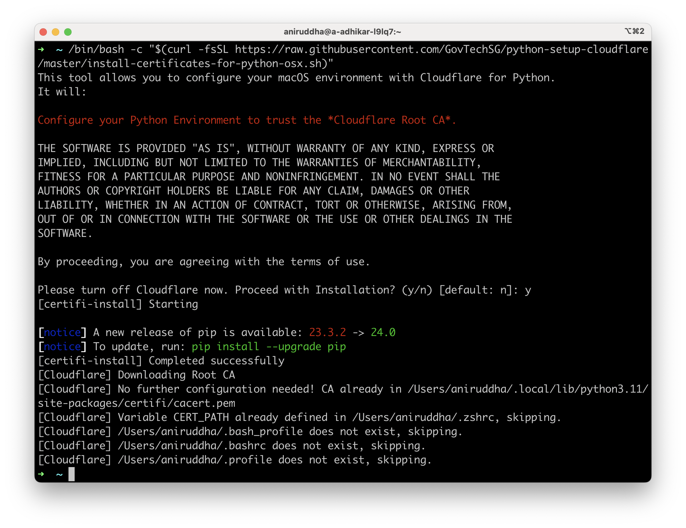

# python-setup-cloudflare
Scripts and instructions for setting up any Python project that requires http requests in Cloudflare Zero Trust environment.



## One-time Setup

For most Python Projects.

### macOS

Run this command in terminal as a `non-root` user. For `virtualenv`s or poetry environments, you need to configure each of them separately.

```bash
/bin/bash -c "$(curl -fsSL https://raw.githubusercontent.com/GovTechSG/python-setup-cloudflare/master/install-certificates-for-python-osx.sh)"
```
